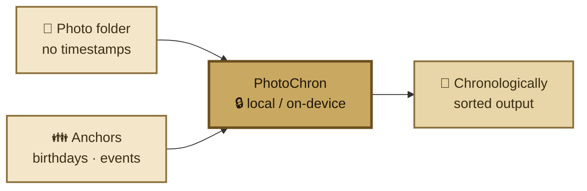
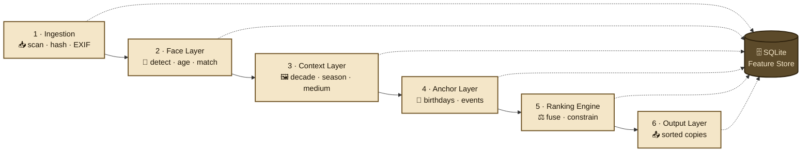

# PhotoChron

> Local-first CLI tool that sorts digitized family photos without timestamps into chronological order — using on-device AI age estimation, visual context analysis, and user-provided anchor data (birthdays, events).

**All inference runs fully on-device. No data leaves your machine.**

---

## How it works



Under the hood, PhotoChron runs a 6-stage pipeline. Each stage writes to a local SQLite feature store, so expensive AI inference runs only once per photo:



See [docs/pipeline.md](docs/pipeline.md) for a deep dive into each stage.

---

## ⚠️ Alpha status

PhotoChron is in **early alpha**. The following CLI commands are currently **demo stubs** and do not yet execute the full pipeline:

- `photochron run` — simulates pipeline progress (no real processing)
- `photochron cluster` — placeholder
- `photochron rerun` — placeholder

The `photochron status` command is functional and reads the SQLite feature store. The underlying pipeline modules (`src/photochron/pipeline/`, `src/photochron/context/`, `src/photochron/face/`, etc.) are implemented and unit-tested, but not yet wired into the CLI. Contributions welcome — see [CONTRIBUTING.md](CONTRIBUTING.md).

---

## Installation

Requires **Python 3.12+** and [Ollama](https://ollama.com) (for the local vision LLM).

```bash
git clone https://github.com/micschr0/image-age-sorter.git
cd image-age-sorter

python -m venv .venv
source .venv/bin/activate   # Windows: .venv\Scripts\activate

pip install -e .
```

For local model setup (Ollama, InsightFace), see [docs/ollama-setup.md](docs/ollama-setup.md).

---

## Quick start

```bash
# Show pipeline status (functional)
python -m photochron status

# Full pipeline run (currently a demo stub — see Alpha status above)
python -m photochron run --input ./photos --output ./photochron_output

# Dry run (no file writes)
python -m photochron run --input ./photos --dry-run
```

Configuration lives in `config.yaml`; anchor data (persons, birthdays, events) in `anchors.yaml`.
See [docs/configuration.md](docs/configuration.md) for all options.

---

## Documentation

- [Pipeline architecture](docs/pipeline.md) — detailed 6-stage walkthrough
- [Configuration reference](docs/configuration.md) — all `config.yaml` options
- [Ollama setup](docs/ollama-setup.md) — installing the local vision LLM
- [Testing](docs/testing.md) — test suite layout and conventions
- [Changelog](docs/CHANGELOG.md)

---

## Contributing

Bug reports, feature requests, and pull requests are welcome. See [CONTRIBUTING.md](CONTRIBUTING.md) for dev setup, test workflow, and coding standards.

---

## License

MIT — see [LICENSE](LICENSE).
