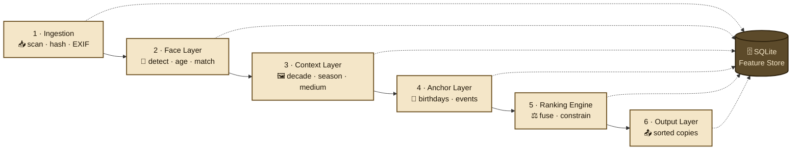

# photochron

> **⚠️ Early alpha — not ready for production use. Expect breaking changes.**

> Local-first CLI tool that sorts digitized family photos without timestamps into chronological order — using on-device AI age estimation, visual context analysis, and user-provided anchor data (birthdays, events).

**All inference runs fully on-device. No data leaves your machine.**

---

## How it works


Under the hood, photochron runs a 6-stage pipeline. Each stage writes to a local SQLite feature store, so expensive AI inference runs only once per photo:



See [docs/pipeline.md](docs/pipeline.md) for a deep dive into each stage.

---

## What you get

photochron never touches your originals. It writes copies into `{output_dir}/` with two complementary layouts:

```
photochron_output/
├── renamed/                                  ← Mode A: chronologically sorted filenames
│   ├── 0001_1987-est_scan_0042.jpg           (prefix = sort rank, then estimated year)
│   ├── 0002_1987-est_scan_0017.jpg
│   ├── 0003_1988-est_scan_0091.jpg
│   └── ...
├── exif_enriched/                            ← Mode B: original names, enriched EXIF
│   ├── scan_0042.jpg                         (DateTimeOriginal = 1987:01:01, UserComment = result JSON)
│   ├── scan_0017.jpg
│   └── ...
├── photochron_report.json                    ← per-photo confidence, anchors used, flags
└── photochron_timeline.csv                   ← flat timeline for spreadsheets
```

**Mode A** lets you drop the `renamed/` folder into any photo viewer and browse your family history in order.
**Mode B** preserves original filenames but writes the estimated date into EXIF, so Apple Photos / Lightroom / digiKam pick it up automatically.

Photos flagged with low confidence end up in `review_needed = true` in `photochron_report.json` — photochron surfaces uncertainty rather than guessing silently.

---

Contributions welcome — see [CONTRIBUTING.md](CONTRIBUTING.md).

---

## Installation

> **Platform note:** photochron has been developed and tested exclusively on **Apple Silicon** (macOS, M-series). The code is plain Python and should run on Linux/Windows too, but those paths are not verified. If you run it elsewhere, please file issues with what worked and what didn't.
>
> For the **face layer to use CoreML / the Apple Neural Engine**, install an `onnxruntime` wheel that includes the CoreML Execution Provider — the official `onnxruntime` wheel for macOS arm64 ships CPU-only. A common drop-in replacement is the community [`onnxruntime-silicon`](https://github.com/cansik/onnxruntime-silicon) package (verify the source before installing). Without it, `face.backend: auto` quietly falls back to CPU. Run `photochron doctor` to check.
>
> **Ollama on Apple Silicon** uses Apple's MLX framework in Ollama 0.19 and newer (faster decode via unified memory); older Ollama versions use the llama.cpp/Metal backend.

Requires **Python 3.12+** and [Ollama](https://ollama.com) (for the local vision LLM).

```bash
git clone https://github.com/micschr0/image-age-sorter.git
cd image-age-sorter

python -m venv .venv
source .venv/bin/activate   # Windows: .venv\Scripts\activate

pip install -e .
```

For local model setup (Ollama, InsightFace), see [docs/ollama-setup.md](docs/ollama-setup.md).

---

## Quick start

```bash
# Show pipeline status (functional)
python -m photochron status

# Full pipeline run
python -m photochron run --input ./photos --output ./photochron_output

# Dry run (no file writes)
python -m photochron run --input ./photos --dry-run
```

Configuration lives in `config.yaml`; anchor data (persons, birthdays, events) in `anchors.yaml`.
See [docs/configuration.md](docs/configuration.md) for all options.

---

## Documentation

- [Pipeline architecture](docs/pipeline.md) — detailed 6-stage walkthrough
- [Configuration reference](docs/configuration.md) — all `config.yaml` options
- [Ollama setup](docs/ollama-setup.md) — installing the local vision LLM
- [Performance tuning & benchmarks](docs/performance.md) — Apple-Silicon knobs, `photochron doctor`, `scripts/bench.py`
- [Testing](docs/testing.md) — test suite layout and conventions
- [Changelog](docs/CHANGELOG.md)

---

## Contributing

Bug reports, feature requests, and pull requests are welcome. See [CONTRIBUTING.md](CONTRIBUTING.md) for dev setup, test workflow, and coding standards.

---

## License

AGPL-3.0-or-later — see [LICENSE](LICENSE).
