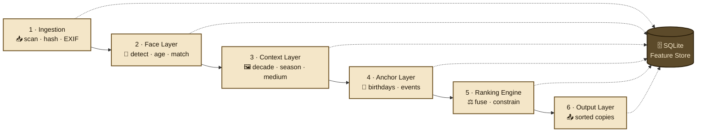

# Pipeline Architecture

PhotoChron uses a 6-stage pipeline where each stage reads/writes to a SQLite Feature Store only. Stages are independently re-runnable via `photochron rerun --stage <name>`.



## Stage 1: Ingestion
**Trigger**: new run or `--rerun-stage ingestion`  
**Input**: JPEG files in input directory  
**Key logic**:
- MD5 content hash per file (rename-safe cache key)
- Downsample to 1024px longest edge → save to `.photochron/thumbs/`
- Read existing EXIF (DateTimeOriginal, Make, Model)
- Perceptual hash for near-duplicate detection (threshold: 0.95)
- Skip if hash already in `photos` table

**Output table**: `photos`  
**Invalidation**: content hash change

## Stage 2: Face Layer
**Trigger**: new photos in `photos` without `faces` rows  
**Model**: InsightFace buffalo_l via ONNX Runtime (CoreML EP on Apple Silicon)  
**Key logic**:
- Detect all faces, compute embeddings + age estimate per face
- Person identity: compare embedding to known persons (cosine similarity > threshold)
- Unknown faces go to cluster pool → resolved by user in `cluster` command
- Output: age_estimate (float), age_std (float), person_id (FK or NULL), bbox

**Output table**: `faces`  
**Latency**: ~100–300ms/image on M3

## Stage 3: Context Layer
**Trigger**: new photos in `photos` without `context` rows  
**Model**: Ollama (llava-next:7b via MLX), fallback moondream2  
**Key logic**:

### Configuration and Health Management
- **Configuration validation**: Performs health checks on Ollama server and model availability at initialization
- **Model selection**: Automatically detects available models and prioritizes based on configuration
- **Graceful degradation**: Falls back to simpler models or enters degraded mode when models are unavailable
- **Health monitoring**: Provides real-time health status via `health_status` property

### Analysis Pipeline
- Structured JSON prompt – never free-text output
- Extract: decade_estimate, decade_confidence, season, event_hint, photo_medium
- Retry logic: Configurable retry attempts with exponential backoff for transient failures
- Minimal data storage: Stores minimal context when analysis completely fails (configurable)
- Pass anchor context in prompt when person birthdays are known

### Resource Management and Monitoring
- **Memory checking**: Before each batch, checks available system memory against configurable thresholds
  - **Warning threshold**: Logs warning when memory falls below `memory_warning_threshold_mb`
  - **Critical threshold**: Skips batch and waits `memory_retry_delay_seconds` when memory falls below `memory_critical_threshold_mb`
  - **Graceful degradation**: Continues processing if memory check fails (psutil unavailable)
- **Progress reporting**: Detailed percentage-based progress logging with 1 decimal place precision
  - **Batch-level progress**: Logs percentage complete at batch boundaries
  - **Photo-level progress**: Logs every 10 photos processed with current percentage
  - **Final summary**: Reports final completion percentage and failure count

### Testing and Quality Assurance
The Context Layer has comprehensive test coverage including:
- **Unit tests**: All 4 analysis strategies (DEFAULT, AGGRESSIVE, CONSERVATIVE, FAST)
- **Integration tests**: Full pipeline integration with database
- **Error handling tests**: Retry logic, fallback strategies, and circuit breakers
- **Confidence validation**: Score validation and propagation through pipeline
- **Database tests**: Transaction integrity and schema compliance

See [Testing Strategy](testing.md) for complete test documentation.

### Configuration Options (`config.yaml` → `context:`)
- `ollama_host`: Ollama server URL (default: `http://localhost:11434`)
- `ollama_timeout`: Timeout in seconds for Ollama requests (default: `300`)
- `max_retries`: Maximum retry attempts for LLM failures (default: `3`)
- `retry_delay`: Delay between retries in seconds (default: `2.0`)
- `primary_model`: Primary vision LLM model (default: `llava-next:7b`)
- `fallback_model`: Fallback vision model (default: `moondream2`)
- `batch_size`: Batch size for processing images (default: `1`)
- `min_decade_confidence`: Minimum confidence for decade estimates (default: `0.3`)
- `min_season_confidence`: Minimum confidence for season estimates (default: `0.4`)
- `use_fallback_on_failure`: Use fallback strategies on analysis failure (default: `true`)
- `store_minimal_on_complete_failure`: Store minimal data when analysis completely fails (default: `true`)
- `memory_warning_threshold_mb`: Memory warning threshold in MB (default: `100`)
- `memory_critical_threshold_mb`: Memory critical threshold in MB (default: `50`)
- `memory_retry_delay_seconds`: Delay in seconds to wait when memory is critically low (default: `30`)

**Output table**: `context`  
**Latency**: ~2–5s/image (7B model, MLX), ~0.5–1.5s/image (moondream2 fallback)

**Prompt contract (output schema)**:
```json
{
  "decade": "1985-1990",
  "decade_confidence": 0.75,
  "season": "summer",
  "event_hint": null,
  "photo_medium": "print_scan"
}
```

**Configuration Reference**: See `docs/configuration.md` for complete configuration options and environment variable overrides.

## Stage 4: Anchor Layer
**Trigger**: runs before Ranking Engine on every run (fast, no inference)  
**Input**: `anchors.yaml`  
**Key logic**:
- Load persons + birthdays → create `AnchorMap` (person_id → birthday)
- Resolve birthday constraints: age_estimate + birthday → estimated_photo_year
- Parse events → create `Constraint` list (type: hard | soft)
- Validate: no contradicting hard constraints; warn on soft conflicts

**Output**: in-memory `ConstraintSet` passed to Ranking Engine (not persisted separately)

## Stage 5: Ranking Engine
**Trigger**: after Stages 2–4 complete  
**Key logic**:

**Step 1 – Weighted date estimate per photo**:
```
estimated_date = weighted_combine(
  face_age_estimate  × 0.45,
  llm_decade         × 0.30,
  photo_medium_prior × 0.10,
  exif_date          × 1.00   # overrides all when present
)
```

**Step 2 – Apply constraints** (hard first, then soft)

**Step 3 – Pairwise LLM comparison for ambiguous pairs**  
(confidence bands overlap → ask LLM: "Which photo is earlier?")  
Cap: max 500 pairs per run.

**Step 4 – Topological sort** → final `sort_rank` per photo

**Output table**: `rankings`

## Stage 6: Output Layer
**Trigger**: after Ranking Engine  
**Two output modes** (both active on full run):

**Mode A – Renamed copies**:  
`{output_dir}/renamed/{sort_rank:04d}_{estimated_year}-est_{original_name}.jpg`

**Mode B – EXIF-enriched copies**:  
`{output_dir}/exif_enriched/{original_name}.jpg`  
EXIF fields written:
- `DateTimeOriginal`: `{year}:01:01 00:00:00` (month/day if known)
- `ImageDescription`: "Est. 1987 ±2yr – Mama ~4yr, summer, print_scan"
- `UserComment`: full JSON result blob

**Additional outputs**:
- `{output_dir}/photochron_report.json`
- `{output_dir}/photochron_timeline.csv`